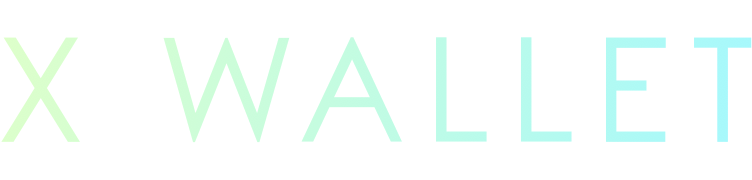

## X Wallet

## Overview

The X Wallet is a native iOS interface for the experimental digital currency Monero. The X Wallet's goal is to deliver the benefits of the Monero protocol without compromise.

The X Wallet should be treated as experimental software. Read and follow these instructions carefully, and **use this software at your own risk**.

## Standard installation and initialization procedure

Connect to a wifi network if possible, then [download the X Wallet via the Apple app store](https://itunes.apple.com/us/app/x-wallet-monero-wallet/id1335168711?ls=1&mt=8).  After the X Wallet initializes, you will be presented with two options: "New Wallet", or "Restore Wallet".

To create a new wallet, tap 'New Wallet'. This is the fastest and recommended way to get started.
1. Enter a PIN. This PIN guarantees access to your X Wallet.
  - When you minimize or close your X Wallet, it will automatically lock.
  - Your PIN is used to unlock the application.
  - Your PIN is used to authorize outgoing transfers.  
2. PIN control. You must validate your PIN to ensure data consistency.
3. Seed mnemonic. You will be presented with 25 random English words, which should be very carefully written down and protected. These random words are called a "seed mnemonic".
  - ⚠️ There is no control check for your seed mnemonic. Please carefully check the spelling and order of the words.
  - The X Wallet seed mnemonic is compatible with the [Monero project wallet software](https://github.com/monero-project/monero).
  - These random words are your Monero. If you lose control of these words, you lose control of your Monero.
  - Never take a screenshot of your seed mnemonic, email it to yourself, or record it using other electronic methods.

To restore an existing wallet, tap 'Recover Wallet'.
1. Enter a PIN. This PIN guarantees access to your X Wallet.
  - When you minimize or close your X Wallet, it will automatically lock.
  - Your PIN is used to unlock the application.
  - Your PIN is used to authorize outgoing transfers.
2. PIN control. You must validate your PIN to ensure data consistency.
3. Mnemonic entry. Here you may enter a seed mnemonic in order to control the funds associated with that mnemonic.
  - ⚠️ There is no control check for your seed mnemonic. Please carefully check the spelling and order of the words.

After you create a new wallet or recover an existing wallet, your X Wallet will synchronize.  
  - If you have created a new wallet, it could take several minutes for your X Wallet to synchronize. Please be patient!
  - If you are restoring an existing wallet, it could take a very long time for your X Wallet to synchronize. This is because your X Wallet must scan a large portion of the Monero blockchain. Please see the note on best practices, below.

## Advanced installation
It is possible, although rather unlikely, that Apple Inc. or another entity could secretly replace the X Wallet binary we have submitted to the App Store with their own. This binary could do evil things: like quietly copy your private view and spend keys, and then secretly transmit those copies somewhere in ways that are difficult to detect.

This isn't really all that practical, and we know adversaries have much easier and cheaper methods in place to track you. But if you want to avoid this particular attack vector, you can build the X Wallet app from source and then install it on your iOS device by yourself. You'll need an Apple laptop or desktop to get started.

Download the X Wallet source code from GitLab, and download and install [Xcode](https://developer.apple.com/xcode/).

When you open Xcode, you can choose to open an existing project. Select the X Wallet folder that you downloaded. Be sure to select the correct developer certificate, and then connect your iOS device to your laptop or desktop using the right cable.

Now you can select your iOS device from the drop-down menu, and click the "Play" button to build the X Wallet. You'll also need to adjust the settings on your iOS device so that you trust yourself as a developer.

## Receiving Monero

To receive Monero, the sender must have your wallet's address. To receive Monero, tap "Receive". The "Receive" view displays your wallet's address as a Quick Response code (QR code) and as a shortened string.
- The sender can quickly copy your address by scanning your QR code when face to face, such as during an in-person meeting or during a video chat session. You could also take a screen capture of your QR code, and send the image as an attachment.   
- Tap "Copy Address to Clipboard" to copy your wallet's address to your iPhone's clipboard, and then paste your address into a messaging or email application.

## Sending Monero

The X Wallet offers two methods for sending Monero: scanning a QR code with your device's camera, and copying and pasting a text address. Both methods enable precise input of the receiver's Monero wallet address and unique (optional) Payment ID. **Please note**: immediately after you send Monero, your wallet must synchronize with the network. This process may take several minutes, and you will not be able to create additional transfers until your wallet is again in sync with the network. Please be patient, and understand that you will not be able to send multiple transfers in rapid succession with early versions of the software!

When creating outgoing transactions, a network provider fee is added to the amount to be sent.
- The network provider fee guarantees the Monero network will confirm your transfer.
- This fee is the "normal" priority setting in the [Monero project wallet software](https://github.com/monero-project/monero).

If you have received a Monero address by text message or email, tap it to select and copy it.
1. Open your X Wallet.
2. From the home screen, tap "Send".
3. Tap "Paste Address".
4. Enter the exact amount of Monero to send.
5. If you are sending Monero to an exchange or large merchant, the merchant may provide you with a Payment ID. Copy the Payment ID the merchant has provided you. Then return to your X Wallet, and tap "Paste".
  - This field is often required when sending Monero to cryptocurrency exchanges or large merchants.
  - If you forget to include the Payment ID the receiver has provided you, the receiving party will have to search for your payment manually. This can take time and cause a lot of stress!
6. Carefully review the Transfer Summary. Check to make sure the address, Payment ID, and subtotal are correct.
      - You must have sufficient funds to complete the transfer.
      - You must agree to the network fee.
7. If you agree with the terms presented on the Transfer Summary, tap "Confirm".
8. Enter your PIN to execute the transfer. You will return to the wallet view.

To send Monero via QR code, tap "Scan QR Code" to open your device's camera.
1. Scan any QR code which contains a valid Monero address.  
    - You will need to give the X Wallet permission to access your camera.
    - The scanned QR code must contain a valid Monero address.
2. Enter the exact amount of Monero to send.
3. If you are sending Monero to an exchange or large merchant, the merchant may provide you with a Payment ID. Copy the Payment ID the merchant has provided you. Then return to your X Wallet, and tap "Paste".
  - This field is often required when sending Monero to cryptocurrency exchanges or large merchants.
  - If you forget to include the Payment ID the receiver has provided you, the receiving party will have to search for your payment manually. This can take time and cause a lot of stress!
4. Carefully review the summary of your transfer. Check to make sure the address, Payment ID, and subtotal are correct.
      - You must have sufficient funds to complete the transfer.
      - You must agree to the network fee.
5. If you agree with the terms presented on the Transfer Summary, tap "Confirm".
6. Enter your PIN to execute the transfer. You will return to the wallet view.

⚠️ Your "Send" button will now be locked, and you will not be able to create another transfer for about 30 minutes. This is a mechanism which helps protect your privacy, and we expect to improve this feature in a future version of the X Wallet.

💡 You don't have to pay any Monero network transaction fees if you decide to use another software, such as the [Monero reference client software](https://github.com/monero-project/monero), to manage your Monero. Simply choose the "Restore" option in the other wallet software, and enter your 25 word seed mnemonic. Make sure the other wallet software is trustworthy before giving it your seed mnemonic!

## Options Menu

The Options View is accessed from the top right corner of the wallet view.
- Display your seed mnemonic
  - Note: take care to only display your seed mnemonic in a private place. Anyone (or any camera) that views your seed mnemonic can potentially steal your Monero.
- Change your PIN
- Connect to a custom Monero remote node
  - If you are running your own Monero remote node, you may connect to it here.
  - Enter your Monero remote node's IP address and port number in the following form: 127.0.0.1:8000
  - Enter your Monero remote node's username and password, if applicable. Leave these fields blank when connecting to publicly accessible remote nodes.  
  - The [guide to running your own remote node](https://gitlab.com/rusticbison/xwallet/blob/master/REMOTENODE.md) is a work in progress.
- Nuke X Wallet
  - Use this feature to create a "cold storage" or paper wallet".
  - Only perform this action after you have secured your seed mnemonic.
  - After performing this action, restoring your seed mnemonic will be the only way to access your Monero.
  - This operation removes all of your wallet data and transaction history from the X Wallet, and closes the X Wallet.

## Troubleshooting
#### I try to create a transfer, but the transfer summary shows a network fee of "0.00000". That sounds too good to be true. When I try to confirm the transfer, it fails. What is going on?

This issue was resolved in v1.2. Please upgrade your X Wallet to the latest version.

#### I just installed the X Wallet, and it’s been syncing for a long time. Now it seems stuck at 99%. What should I do?

Try to close the X Wallet application, then re-start it. You should see the main view has been synchronized.

#### It takes a really long time to sync.

You can try to find a faster remote node to connect to, or you can setup your own remote node. When you have the IP address and credentials of the new remote node, enter it in the “Settings” view.

#### Monero was sent to my X Wallet, but I don't see it.

Don't panic. First make sure:
- Your iOS device has a network connection.
- You X Wallet has permission to access the network. If you do not have a wifi connection, make sure your X Wallet has permission to use the cellular network.
- Your VPN is functioning properly, if applicable.
- The transfer was actually sent. You may ask the sender for the transaction ID, your address, and the transaction key so that [they may prove the transaction was sent](https://getmonero.org/resources/user-guides/prove-payment.html).
- Make sure the remote node you are connected to is functioning properly.

⚠️ On startup, the X Wallet connects to a random remote node from https://moneroworld.com/. It is possible, even likely, the node you connect to will have very poor performance. *Poor performing nodes will prevent you from seeing any new transfers you may have received and from broadcasting new transfers. You can 1) close and restart the X Wallet to force a new connection to a hopefully better quality node, or 2) connect to your own remote node where you are in control of the hardware.* You can even buy pre-built remote nodes now, from vendors like https://icryptonode.com/ (we have no affiliation).

Depending on network conditions and the hardware performance of the node you are connected to, it may take several minutes for newly received transactions to appear.

Please note: if you have sent Monero to your X Wallet from a custodial software application and you do not see the funds appear in your X Wallet, please check your transfer details against a block explorer to ensure that the transfer actually occurred. Custodial wallets are often designed to steal cryptocurrency.

#### One word of my seed mnemonic is repeated. Is that normal?

This is intentional, the repeated word is a "checksum". This checksum proves that your seed has been generated properly.

#### I didn't write down my seed mnemonic when I first installed the X Wallet. Now I have a lot of Monero in my X Wallet. What should I do?

You can access your seed mnemonic from the “Settings” view. Make sure to write it down and keep it safe!

#### Something happened to the X Wallet, is my Monero safe?

If the remote node the X Wallet connects to is not available, or you lose your network connection, or the X Wallet disappears from the App Store, or anything else strange or unexpected happens, don't worry: if the seed mnemonic you have written down is safe, your Monero is safe. If the worst happens to the X Wallet, remember that you can always regain control over your Monero by importing your seed mnemonic into the [Monero reference client](https://github.com/monero-project/monero).

#### I sent some Monero, and my "Send" button is locked! Have you stolen my Monero? Why can't I create another transfer?

Don't panic, this is normal. Please see the section of this README titled "Sending Monero".

#### I received some Monero, but my "Send" button is still locked. Why?

Your X Wallet is still syncing, please be patient. This process could take a few minutes, or a few hours, depending on the condition of the remote node you are connected to.

## Best Practices

#### Restoring your wallet

Operations that take a lot of network and computational resources, like synchronizing with the Monero network, can’t be performed in the background on iOS. This means that a serious sync operation, like restoring your X Wallet using your seed mnemonic, will be very tedious and take a lot of your time and attention.

Instead of trying to import an existing seed mnemonic into the X Wallet, we recommend the following:
* Follow the normal recovery procedure using the Monero reference client on your Mac
* Install the X Wallet on your iOS device, and create a new wallet.
* Send some Monero from your reference client on your Mac, to your new X Wallet

Note that you will need to pay a Monero network fee in order to complete the transfer.

#### Cold storage technique

Install the X Wallet using either the standard or advanced installation method, then sign out of your iCloud account to prevent your app data from being backed up on iCloud. Note that since v1.1.0.1, some hashed data will likely remain in your keyring. Carefully follow the instructions in this README to create a new wallet.

Next, you might want to conduct a test:
- send a small amount of Monero to your X Wallet
- remove the X Wallet app from your iOS device
- reinstall the X Wallet and restore from your mnemonic (please see “Restoring your wallet” above)

After you are comfortable and confident with this process, copy your X Wallet's receiving address and/or QR code and save them somewhere. This way, the seed mnemonic you have written down can keep receiving Monero.

Finally, delete the X Wallet app from your iOS device, and follow Apple's instructions for securely resetting your iOS device to its factory settings. When you want to check the balance of this wallet or spend your Monero, simply restore your wallet (see “Restoring your wallet” above).

## FAQ
#### How do I get Monero?

Create something and then trade it for Monero, like [this cool hat](https://imgur.com/a/6xvsT). You can also mine Monero, trade cash for it with a friend, or buy from an online exchange. The exchange symbol for Monero is `XMR`.

#### Not your keys, not your coins. Where are my view keys and spend keys created and stored?

Your keys are generated on your iOS device, and they never leave your device.

#### How do you generate the seed mnemonic?

The X Wallet uses the Monero reference client's methods (Monero RPC) to generate the seed mnemonic in a sandboxed environment on your iOS device.

#### Is the X Wallet associated with the Monero project?

No. The X Wallet is developed and offered by XMR Systems LLC. Neither the X Wallet nor XMR Systems LLC is affiliated in any way with the Monero Project or the Monero Developers.

#### Is 32 bit hardware supported?

The X Wallet is built for 64 bit architecture.

#### If I restore from my seed mnemonic, I will have full control over my Monero. Will my transaction history also be restored?

Your transaction history is not backed up and cannot be recovered. If your transaction history is important to you, you should keep separate records.

#### How can I speed up the synchronization process?

If you use your X Wallet frequently, it should synchronize relatively fast. The opposite is also true: if you use your X Wallet infrequently, it will take much longer to synchronize.

#### Are there any privacy issues I should be concerned with?

Your X Wallet connects to a random Monero remote node, which maintains a copy of the Monero blockchain. Remote nodes can't learn about your Monero activities, but they can see your IP address, as well as the timing and frequency with which you connect. Malicious third parties will track and analyze this data. Use a VPN to protect your privacy, and connect to a remote node which you control.

#### How do you fund development?

Donations. Funds are used to pay ridiculously low wages for programming effort. You can donate to development using this address:

`44r3NncNrigGfoTuyiWv461PXxEcYaRrVLKzYRTTCPKhQMbnVNjufmkQp2zCVZrJA7RLpA3BrWQUCgLtBaPwbm7bUt54ePj`

## Contact
Justin Smith  
[@rusticbison](https://twitter.com/@rusticbison)  
js@xwallet.tech

## Credits
#### Team in Zürich🇨🇭
* Programmer: [Jürgen](http://www.22of8.ch)
* Designer: [Rizvi](http://www.designeese.ch/)

#### Support
* Sysops: [Eduardo](https://ebalsa.org/)
* x86_64 and arm64 builds: [Dan](https://www.linkedin.com/in/dkoio/)

## Reference
* [X Wallet webpage](https://xwallet.tech/)
* [X Wallet webpage source](https://gitlab.com/rusticbison/website-xwallet)
